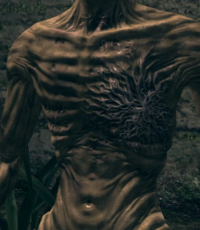
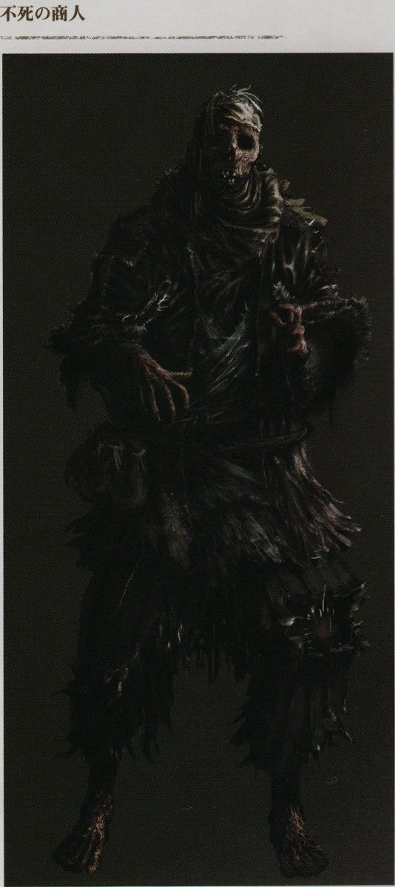
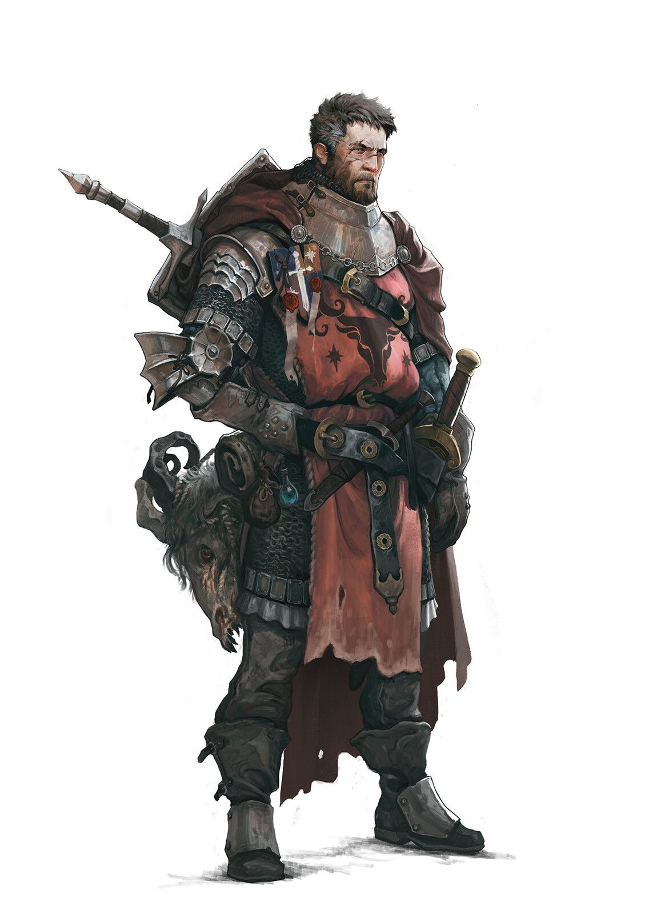
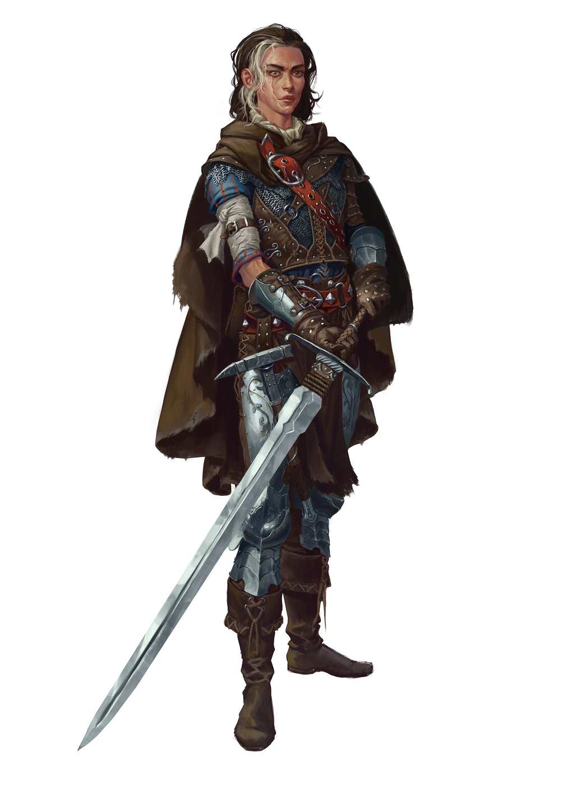

# Dawn of Blight

##### Un Univers de RPG inspiré des Souls aux thèmes eldritch et sombres.

## Le lore de Dawn of Blight

### Localisation et date

Dawn of Blight prend place dans un futur dystopique où la population de l'Ici, ce plan de l'existence, a été réduite à une mèche de ce qu'elle représentait autrefois par une pandémie destructrice : le Fléau.

### Les comtés du Dawn

Les comtés du Dawn représentent l'entièreté du monde connu. Parmi eux, seul un océan est connu, à l'Est du Dawn, et est jusqu'à preuve du contraire d'une superficie infinie : Le Bord de l'Ici.

Mis à part la Tour de l'Aube et le Coeur Irréel, aucun point d'intérêt n'est connu dans le Dawn : suite aux ravages du Fléau sur les comtés, les villes à haute densité de population ont disparu.

Les clusters de propagation du Fléau se multiplient, et les zones sûres disparaissent les unes après les autres. Toute forme de vie semble être au bord de l'extinction...

Partout, les humains pourrissent et meurent, et avec eux, l'humanité de ceux qui survivent. La méfiance règne et "altruisme" est un mot dont le sens est depuis longtemps oublié.

### Le Fléau

Le Fléau est une affliction maintenant répandue dans le Dawn tout entier. Les personnes affectées par le Fléau semblent souffrir jusque dans le creux de leur âme, rendues démentes par la douleur et les symptômes psychologiques de la maladie longtemps avant qu'elle ne dévore leur enveloppe corporelle.

Les populations du Dawn ont des réactions différentes lors d'épidémies du Fléau : certaines tribus de peuples reclus, terrifiés par ses effets, abattent de sang-froid leurs pairs infectés avant de se débarasser de leurs cadavres; D'autres civilisations plus clémentes banissent leurs malades dans une zone de quarantaine où ils vivront et mourront entre eux.

Il est dit qu'aucune âme dans l'Ici ou les Ailleurs ne connaît de remède ni même de traitement contre le Fléau. Il semblerait que cette peste soit inarrêtable.

## Système d'actions et de combat

Dans Dawn of Blight, le combat est dangereux, et les personnages qui ne sont pas clairement destinés à résister aux coups (comme La Brute, l'Ornementé ou le Maître d'Armes utilisant un bouclier) devront faire preuve d'agilité pour esquiver les coups (le système de combat est orienté vers l'esquive plus que sur le tanking).

Chaque tour représente 6 secondes, pendant lesquelles chaque Héros peut effectuer des actions selon des règles définies. Le personnage peut :

 - Se déplacer de 30ft (~9m)
 - Effectuer une **Action Simple** (AS), comme attaquer avec ou sans arme, se déplacer à nouveau de 30ft ou ouvrir un coffre
 - Effectuer une **Action Rapide** (AR), comme ranger une arme ou en changer, asséner un coup de pommeau ou utiliser une compétence de Héros spécifiquement désignée comme *Rapide*

OU
 - Effectuer une **Action Lente** (AL), qui lui prendra le tour entier, l'immobilisant (comme la *Méditation* de l'Adepte) ou le déplaçant différemment d'un mouvement normal (comme l'*Attaque Sautée Arrière* du Maître d'Armes)

Les Héros ont aussi une et une seule (à l'exception de l'Adepte, du Maître d'armes se remémorant sa Présence et du Corrompu souffrant l'affliction du Jumeau, qui en ont deux) **Réaction** (R) par tour de jeu, leur permettant, alors que leur tour d'action est terminé, de réagir à une attaque ennemi ou un évènement de leur choix (à la discrétion du DM), en effectuant par exemple un pas de côté pour essayer d'éviter un coup d'épée ou une flèche.

Dans de rares cas, un Héros pourra effectuer une **Action Héroïque** (AH). Ces actions sont caractérisées par le fait qu'elles nécessitent plusieurs tours pour être amenées à terme, parfois en restreignant le mouvement du Héros.

## La magie dans Dawn of Blight

Dans les comtés du Dawn, la magie, bien que rare, est puissante. Cependant, peu connaissent réellement ses origines : elle se repose en réalité sur la perturbation des frontières entre le plan d'existence sur lequel le Dawn se trouve et les autres, respectivement appelés par les initiés l'*Ici* et les *Ailleurs*.

C'est pourquoi les fanatiques de Ganagoth, une caste sectaire prêchant la parole d'un hypothétique être surpassant les frontières entre les Ailleurs, méprisent l'arrogance et l'élitisme des apprentis et érudits de la Tour de l'Aube car ceux-ci sont convaincus d'avoir la capacité de conjurer des sorts naturellement sans perturber l'équilibre de ces frontières.

Certains peuples nient l'existence de la magie dans son ensemble, comme les moines qui ne croient qu'en leur divinité et pense que les capacités des mages sont des dons de sa part.

## Liste des armes

 - Toutes les armes de départ sont tirées de [ce site web](https://www.dandwiki.com/wiki/5e_SRD:Weapons).
 - Elles gardent leurs statistiques de base, si ce n'est le poids qui est géré différement dans Dawn of Blight.
 - Les Armes Super-Lourdes prennent une AS à dégainer, et les autres une AR. Les Armes de lancer Légères peuvent être dégainées et lancées en une seule AS. Sinon, deux AR peuvent être utilisées pour les dégainer puis les jeter.
 - Sont considérées "à distance" les armes utilisables seulement à distance.
 - Sont considérées "martiales" les armes définies comme telles dans le lien présent ci-dessus ou, pour celles qui en sont absentes, à la discrétion du DM. Les armes martiales sont restreintes au Maître d'Armes, l'Exilé, l'Ornementé et le Fou grâce à la compétence passive *Entraîné*.
 - Seuls le Maître d'Armes et l'Ornementé peuvent utiliser des boucliers grâce à la compétence passive *Protecteur*. Porter un bouclier limite les déplacements, ce qui est traduit dans Dawn of Blight par une limitation qui n'est évitable dans aucun cas d'une seule Réaction par tour.
 - Les armes et boucliers n'ayant pas de stats proviennent du lien présent ci-dessus, leurs stats sont donc disponibles là-bas. Celles en ayant sont donc importées d'autres sources ou crées de toutes pièces par moi-même.

### Armes de mêlée

#### Armes Super-Lourdes :

 - Massue lourde

#### Armes Lourdes :

 - Masse d'armes

#### Armes Moyennes :

 - Bâton
 - Lance
 - Arbalète légère
 - Massue

#### Armes Légères :

 - Dague
 - Hachette
 - Javelot
 - Marteau court
 - Couteau de lancer
 - Arc court
 - Fronde
 - Faucille

### Armes martiales de mêlée

##### Armes Super-Lourdes

 - Grande hache
 - Maul
 - Marteau de guerre

##### Armes Lourdes

 - Hache de combat
 - Fléau
 - Fauchard
 - Grande épée
 - Hallebarde
 - Lance de cavalerie
 - Étoile du matin
 - Pic
 - Pic de guerre
 - Arbalète lourde
 - Arc long

##### Armes Moyennes

 - Épée longue
 - Rapière
 - Cimeterre
 - trident
 - Fouet

##### Armes Légères

 - Épée courte
 - Sarbacane
 - Arbalète à main

### Armes à distance

#### Armes Moyennes :

 - Arbalète légère

#### Armes Légères :

 - Javelot
 - Couteau de lancer
 - Arc court
 - Fronde

### Armes martiales à distance

##### Armes Lourdes

 - Arbalète lourde
 - Arc long

##### Armes Moyennes

##### Armes Légères

 - Sarbacane
 - Arbalète à main

## Les Héros de Dawn of Blight

### Le Maître d'armes

##### Le Maître d'armes est un guerrier expérimenté et durci par la guerre, dont l'expérience de combat peut être mesurée au nombre de cicatrices. Son expertise des armes de mếlée lourdes est inégalable.

#### Passifs au niveau 0 :

 - *Harnaché* : Le Maître d'armes est le seul personnage capable de porter plus de deux armes. Il est équipé de :
   - Un crochet dorsal, qui peut accueillir une arme lourde ou une arme moyenne
   - Un fourreau de hanche, qui peut accueillir une arme moyenne ou deux armes légères
   - Un fourreau lombaire, qui peut accueillir une arme légère à l'horizontale.
	
 - *Protecteur* : Le Maître d'armes est le seul, mis à part l'Ornementé, à pouvoir utiliser des boucliers. Lorsqu'il utilise un bouclier, le Maître d'Armes ne peut avoir qu'une *Réaction* par tour, même si des compétences l'affectant indiquent le contraire.
 - *Forgé par la guerre* : Le Maître d'armes, fort de son expérience au combat, a un bonus naturel de +1 à tous les jets d'attaque.
 - *Polyvalence* : Les arbres de compétence du Maître d'armes se rejoignent à chaque niveau et ne requièrent pas d'adjacence avec la dernière compétence choisie, lui permettant de passer de l'un de ses arbres à n'importe lequel des autres n'importe quand.

#### Compétences Actives au niveau 0 :

 - *Feinte* : Le Maître d'armes est capable de déceler le potentiel d'une arme qu'un simple mercenaire ne verrait pas. Il peut donc utiliser son Action Rapide en plus de son Action Simple lorsqu'il attaque, pour attaquer avec un avantage.
<!-- TODO autres compétences actives ? -->

#### Arbres de compétences :

Le Maître d'armes a accès à quatre arbres de compétences :

 - *Souvenirs de l'Art de Combat* : Cet arbre permet au Maître d'armes de se remémorer des techniques qu'il a apprises au cours de sa vie. C'est ici que vous trouverez de nouvelles compétences requérant de l'agilité et de la maîtrise des armes. <!-- genre tournoyer avec l'arme etc -->
 - *Souvenirs de Force* : Cet arbre contient tous les souvenirs des exploits de force que le Maître d'armes a un jour atteint. Dans cet arbre de compétences, vous trouverez des compétences nécessitant de la force brute, utiles en combat comme ailleurs. <!-- techniques genre briser une garde avec une arme lourde, ou une porte avec un coup de pied. Actions Lentes -->
 - *Souvenirs de Robustesse* : Cet arbre représente tous les souvenirs des jours anciens où le maître d'arme était solide. Vous retrouverez ici des compétences améliorant la longévité du Héros ou permettant de faire de lui le centre d'attention des rangs ennemis. <!-- (tank, taunting -->
 - *Souvenirs de Présence* : Cet arbre est rempli de souvenirs de jours où le Maître d'armes a prouvé ses capacités sur le champ de bataille, faisant résonner son nom dans toutes les bouches des comtés du Dawn. Il présente les compétences permettant au Héros de combattre contre des ennemis multiples et d'utiliser son aura elle-même comme une arme. <!-- capacité à gérer plusieurs ennemis en même temps et force psychologique -->

#### Équipement de départ :

Emplacements : 

 - Crochet dorsal : Une arme lourde ou une arme moyenne
 - Fourreau de hanche : Une arme moyenne ou deux armes légères
 - Fourreau lombaire : Une arme légère

### Le Corrompu

##### Le Corrompu est un mercenaire au triste destin, dont le corps et l'âme sont infectés par une Entité venue d'un Ailleurs inconnu.

#### Passifs au niveau 0 :

 - *Deux fois deux yeux* : L'Entité ayant une conscience et une perception du monde propre à elle, elle peut aider le Corrompu en le prévenant parfois des dangers qui l'entourent ou des avis qu'elle a sur des situations ou des personnages. <!-- Il gagne occasionnellement aussi un bonus de +1 aux jets de sagesse --> 
 - *Ouïe du vide* : L'Entité sent les perturbations entre les Ailleurs et peut prévenir le Corrompu d'éventuelles tentatives d'attaques magiques.
<!-- TODO actifs arbre de compétence :  - *Enveloppe Instable* : Le Corrompu est capable de repousser violemment une personne qui touche sa peau nue d'une onde de choc envoyée par l'Entité.
 - *Sacrifice Protecteur* : L'Entité sacrifie une partie de son être pour boucher un portail ouvert par un sort ennemi, l'empêchant d'exister dans l'Ici. -->

#### Compétences actives au niveau 0 :

 - *Perturbation mineure* : AS. Le Corrompu perturbe légèrement l'équilibre entre l'Ici et les Ailleurs dans un point donné que peut atteindre l'Entité tendant le bras. Cette zone reste à cet endroit un tour, et tout personnage dont la tête la traverse est perturbé, voyant un court instant la frontière entre le réel et l'impossible se brouiller. Il est donc objet d'un désavantage dans tous ses jets de perception et de réaction. <!-- niveaux suivants : plus longtemps OU plus gros, et l'un ou l'autre pas les deux -->
<!-- TODO autres-->

<!-- tp ou portail / passer à travers mur / coup de main : main de l'entité au même endroit que main du corrompu --> 

#### Arbres de compétences :

Le Corrompu a accès à trois arbres de compétences :

 - *Affliction du condamné* : Cet arbre, qui représente la force de l'Entité habitant le Corrompu, contient des compétences puissantes mais qui forceront le Héros à s'abandonner à chaque fois un peu plus à elle, décuplant son pouvoir en en payant le prix : son humanité.
 - *Affliction du jumeau* : Le Corrompu empreintant ce chemin apprend à cohabiter avec l'Entité et établit une communication qui lui apporte des compétences stratégiques et de reconnaissance, dont l'efficacité est démultipliée par les deux esprits l'habitant.
 - *Affliction du démoniste* : Cet arbre représente la volonté du Corrompu. Il propose des compétences qui lui permettront de maîtriser l'entité, la réduisant à un simple outil, révélant des sorts de divination et de dématérialisation techniques qui se reposent sur la complexité de la conscience humaine et permettront au Corrompu de quitter son enveloppe corporelle.

Les arbres du Corrompu se rejoignent à certaines compétences "ponts" :

 - *Afflictions du Condamné et du Jumeau* : Ces compétences demandent au Corrompu de laisser l'Entité prendre le contrôle pendant un temps tout en restant conscient.
 - *Afflictions du Jumeau et du Démoniste* : À l'inverse, ces compétences permettent au Corrompu de puiser dans les pouvoirs bruts de l'Entité et de s'échapper un instant des limites de son corps humain sans pour autant l'abandonner.

### L'Érudit

##### L'Érudit est un prodige de la Tour de l'Aube, formé dans les arts des quatre écoles de magie.

#### Passifs au niveau 0 :

 - *Élève modèle* : Le mage est intelligent, et a longuement étudié dans l'anticipation de ses missions pour la Tour. <!-- Il possède un bonus de +1 à tous les jets d'intelligence --> 
 - *Entraînement Psionique* : Le mage, fort de son entraînement dans la Tour, possède une résistance accrue aux attaques mentales. <!-- désavantage contre lui -->

#### Compétences actives au niveau 0 :

 - *Séparation* : AS. L'Érudit peut écarter violemment des objets d'un même élément ou briser un objet déjà fragile.
 - *Flèche élémentale* : AS. L'Érudit est capable de conjurer une flèche grossière d'un élément de son choix.
 - *Courage* : AS. L'Érudit sait user de ses mots et de ses pouvoirs pour agir sur la perception d'un allié, lui permettant de faire abstraction de dommages pris pendant un instant. <!-- pv temporaires vraiment temporaires genre +3 HP pendant 3 tours -->
 - *Suggestion* : AR. L'Érudit peut utiliser sa magie pour appuyer ses propos et les faire sembler plus convaincants à qui les entend.

#### Arbres de Compétences :

L'Érudit a accès à quatre arbres de compétences correspondant aux quatre écoles de la Tour de l'Aube :

 - *École de la destruction* : Cet arbre de compétences, représentant des sorts utilitaires enseignés dans la Tour mais détournés par ses apprentis, contient des sorts capable de détruire, d'une façon ou d'une autre, des éléments présents autour de l'Érudit. Ces sorts sont dangereux, et demandent de la part des érudits un bon niveau de contrôle d'eux-mêmes pour ne pas mal finir. <!-- Plus les sorts sont puissants puis il perd le contrôle -->
 - *École du mimétisme : Cet arbre contient les sorts les plus artistiques de la Tour. La déformation des éléments qui les entourent permettent aux érudits de forger le monde à leur bon vouloir. Malheureusement, personne n'est assez puissant pour combiner taille, durée, solidité et finesse dans un seul sort. <!-- (contrôle des éléments pour autre chose que de la destruction, genre des cages) - t'es obligé de perdre soit la taille de ces constructions, soit leur durée, leur solidité ou leur précision -->
 - *École de l'ouverture* : Cette école est celle des altruistes, aussi peu nombreux qu'ils soient dans l'environnement orgueilleux et élitiste de la Tour de l'Aube. Elle enseigne aux apprentis des sorts de soin, d'aide et de protection. <!-- (soin, buffs, armures) -->
 - *École du contrôle* : Cet arbre représente l'enseignement dispensés aux apprentis de la Tour concernant les esprits. Il présente des sorts orientés vers le contrôle du psyché et la manipulation. Les sorts les plus puissants demandent aux érudits de se concentrer, faisant abstraction de leur alentours. <!-- Plus les sorts sont puissants plus ils demandent de concentration, le coupant du monde -->

Les quatre arbres de compétences de l'Érudit se rejoignent à certains sorts, partagés entre les écoles. <!-- 
destruction / mimétisme : bombes élémentales
mimétisme / ouverture : armures
ouverture / contrôle : liaisons entre les esprits de ses potes (entre eux ou avec ses adversaires ou même les adversaires entre eux), débuffs ennemis -->

### La Brute

##### La Brute est un ogre monstrueux aux origines volcaniques singulières, qui frappe avant de parler et agit avant de réfléchir.

#### Passifs au niveau 0 :

 - *Taille Gargantuesque* : La Brute est énorme, lui permettant de s'interposer au milieu d'un combat ou d'une zone de taille réduite pour changer le cours de l'action. Cependant, cette taille peut s'avérer problématique dans des situations nécessitant de la discrétion ou de l'agilité. <!-- malus de -2 sur les jets de discrétion et bonus de +2 sur les jets de constitution -->
 - *Force de Goliath* : La Brute, de par sa taille et ses origines guerrières, est capable de prouesses de force qu'un humain n'atteindrait jamais, même avec de l'entraînement, sans l'intervention de la magie.  
La Brute est le seul Héros capable de porter les armes de la catégorie ultra-lourdes, telles que les marteaux brise-roche, les massues montagnes, les gantelets, *etc*. <!-- +2 sur les jets de force aussi -->
 - *Sang Chaud* : La Brute tient difficilement en place : Il est difficile pour elle de ne pas s'énerver lorsque provoquée, par exemple. <!-- justifie aussi le même malus de -2 sur la discrétion et désavantage sur les jets de sagesse lorsque provoqué -->

#### Compétences actives au niveau 0 :

 - *Éruption* : AS. La Brute entre dans un état de rage aveugle et alors que son coeur bat à une vitesse folle, son sang se met à bouillir. Dans cet état, la peau de la brute est rouge et fumante, et des jets de vapeur s'échappent de ses pores. La Brute est incapable de tenir une arme en bois ou en métal sans la détruire, mais obtient un bonus de dégâts et de constitution considérables grâce à cette montée d'adrénaline -- non sans en payer le prix ensuite. Sortir de cet état consomme une AR. 

#### Arbres de compétences :

La Brute possède deux arbres de compétences :

 - *Descendance Monstrueuse* : Cet arbre contient des compétences liées à la descendance d'ogre de La Brute, qui lui permettront de mettre à l'oeuvre sa force dans des épreuves de destruction et de dégâts bruts. C'est aussi ici qu'il acquerra la capacité de terrifier ses adversaires lors de ses excès de rage comme en dehors.
 - *Descendance Volcanique* : Cet arbre de compétences correspond à la descendance de brasier de La Brute. C'est dans celui-ci que vous trouverez des compétences lui permettant d'améliorer ses dégâts de feu et de chaleur, de produire plus de dégâts lors de sa compétence *Éruption* et de mieux y résister lui-même.
<!-- citation de shakespeare intelligence mdr dans une compétence complètement hors-sol -->

### L'Adepte

##### L'Adepte est un pieux moine guidé par sa foi. Sa spiritualité est l'origine de sa force et fait de lui la preuve vivante que cette force peut prévaloir sur celle du corps. Les arts martiaux aident pas mal.

#### Passifs au niveau 0 :

 - *Un esprit sain dans un corps sain* : L'Adepte est frêle, mais sa foi est robuste, et rien ne peut l'ébranler. L'Adepte a **très** peu de points de vie mais chacun de ces PV est protégé par des points de *Foi*, qu'il peut récupérer en *Méditant*. <!-- compétences Un esprit sain dans un corps sain II - III - IV : 7, puis 10, puis 12 PF par PV -->
 - *Sixième sens* : L'Adepte est de nature calme et observatrice. Il peut réagir deux fois par tour aux actions adverses.
 - *No Stress* : L'Adepte ne gâche aucune goutte de sueur dans des mouvements surperflus, et aucune seconde passée à bouger ne l'est en vain. L'Adepte peut utiliser une AS et deux AR par tour. <!-- compétence No Stress II : il peut utiliser une fois une AR en tant qu'AS une fois par short rest-->
 - *Je Connais Le Kung-Fu* : L'Adepte est un artiste martial aguerri et sa foi lui proscrit d'utiliser des armes. Il ne peut donc se battre qu'à mains nues, mais jouit d'un bonus de dégâts dans cette pratique.

#### Compétences Actives au niveau 0 :

 - *Méditation* : AL. L'Adepte s'assoie en tailleur et fait abstraction totale du monde qui l'entoure. Dans la tranquilité, il trouve la plénitude, ainsi que tous les Points de Foi perdus pour le PV actuel. La *Méditation* est interrompue par une attaque. <!-- Méditation II : si déjà à fond dans la foi d'un PV, il peut récupérer un autre PV avec 0 de foi en méditant -- Méditation III : la méditation lui laisse quand même une réaction par tour, qui brise la méditation aussi, mais au moins ne lui fait pas perdre de PV s'il parvient à esquiver -- Méditation IV : Il récupère tous les PF ET le PV avec 0 de foi quand il médite -->

#### Arbres de compétence :

 - *Voie du corps* : Cet arbre de compétence représente l'entraînement assidu que l'Adepte a suivi pour faire de son enveloppe charnelle le récipient parfait pour un esprit robuste. Il contiendra des compétences lui permettant d'augmenter les dégâts produits à chaque tour, souvent en attaquant de manière répétée.
 - *Voie de l'esprit* : Cet arbre contient toutes les compétences relatives à la concentration hors-normes de l'Adepte. S'y trouvent des compétences actives et passives relatives à celle-ci, qui lui permettront de résister aux dégâts psychiques ou de lire les mouvements de ses adversaires.
 - *Voie de la foi* : Cet arbre contient les compétences liées à la foi inébranlable de l'Adepte, comme des prières accordant des protections divines ou des aides en combat.

Les arbres de compétences se rejoignent sur certaines compétences ponts, qui mêlent les caractéristiques de deux arbres.

<!-- chaque dégât = 2 points de volonté ? maybe prière qui fait que chaque dégât = 1 point de volonté ? -->

### L'Exilé

##### L'Exilé est un marin épéiste originaire d'une île de l'Archipel des Météores à l'Est des comtés du Dawn, dans le Bord de l'Ici. Son passé est brumeux, mais il ne tient pas son nom de nulle part.

#### Passifs au niveau 0 :

 - *Iaido* : L'Exilé a pratiqué le *Iaijutsu*, ou l'étude de l'art de dégainer le sabre, et obtient un considérable bonus lorsqu'il attaque en premier, par surprise ou par opportunité.
 - *Calme du loup* : L'Exilé, dans sa vie de pêcheur, a appris à ne pas effrayer ses prises. Il est particulièrement silencieux lorsque la situation l'impose et sait tirer profit de ses capacités de discrétion. Il est aussi, de ce fait, plus facilement caché dans la fumée et la brume.
 - *Grimpeur* : L'Exilé a passé sa vie de marin à escalader les mâts et les échelles de cordes des bateaux voguant sur le Bord de l'Ici. Il est agile et sait faire profit de toutes les accroches présentes sur une surface pour y grimper avec plus de facilité. Il est aussi capable de monter des murs plus hauts que ce dont la moyenne est capable. <!-- Grimpeur II : L'Exilé obtient une corde au bout de laquelle est attachée un poids en métal, lui permettant de swing sur toutes les poutres et autres barres qu'il trouve, ou de grimper sur un mur surplombé d'un poteau vertical. En combat, la détacher de sa ceinture utilise une AS -- Grimpeur III : La corde de l'Exilé est enfilée dans une manchette autour de son bras, lui permettant de la dégainer rapidement, même en combat avec une AR. Il peut maintenant aussi s'en servir pour des attaques de type lasso et swing en plein combat -- Grimpeur IV : L'Exilé remplace sa corde - et son bras droit - par une prothèse à ressort chargée d'un grappin en métal, qui lui permet (à l'aide d'une AR en combat) de tirer ce grappin dans une surface, aussi dure que du bois ou aussi fragile qu'un torse humain. il lui faut une AS pour rétracter son grappin avec une petite manivelle, ou une AL s'il s'agit de tracter un poids, comme un corps -- Grimpeur V : La prothèse de l'Exilé est maintenant chargée d'un moteur qui rétracte violemment le grappin au lieu d'une manivelle. Il peut donc le rétracter avec une AR, ou une AS s'il s'agit de tracter un poids. -->

#### Capacités actives au niveau 0 :

 - *Sprint Estoc* : AS. L'Exilé sprinte en avant (en plus de son déplacement) et saute l'épée tendue, dans un mouvement perforateur. Ce coup peut percer les armures de cuir. <!-- compétence II : Sprint Croissant : AS, l'exilé sprinte en avant et slice à l'horizontale, dans un coup moins puissant que le sprint estoc mais qui permet de couper plusieurs ennemis en même temps -- compétence III : Sprint Balayeur : AS, l'exilé sprinte en avant et slice à l'horizontale tout en glissant en coupant les chevilles de ses adversaires -->
 - *Bombe Fumigène* : AR. L'Exilé jette une bombe fumigène sous ses pieds, qui explose instantanément. Toute personne dans un rayon de 5 pieds du point d'impact gagne une immunité aux attaques d'opportunité et les attaques (qui ne sont pas des attaques de zones) sur eux ont un désavantage. L'Exilé peut utiliser une AS pour l'envoyer autre part, à distance maximale de 30ft (9m). Cette compétence est disponible 2 fois par long repos, puis 3, 4 et 5 au niveaux II, III et IV de compétence.
 - *Pistolet à silex* : 

#### Arbres de compétence :

L'Exilé
    shinobi & pirate
    pistolet à poudre, épée courbée comme un katana mais dual sided, bombes à fumigènes et juste bombes.
    trois arbres :
        arbre du loup solitaire (aikido),
        arbre de l'harmonie (attaques combinant les deux origines),
        arbre du loup de mer (compétences de pirate).
    ils se rejoignent un niveau sur deux
<!-- grappin, tyrolienne quand amélioré -->

Le Martyre
    ranger - druide, trappeur
    parle aux animaux, enchanteur. a les deux yeux percés de ronces et du sang sur le visage et voit donc comme daredevil mdr :
    ne peut pas voir les couleurs ou les écritures mais peut voir les formes parfaitement et dans le noir, même cachées sous un cloth
    arbres : 
        arbre de 

L'Ornementé (Paladin, protecteur : corps en armure toujours, vraiment lent) arbre de l'ange, <!-- trouver des arbres / copier le passif protecteur du maître d'armes -->

Le Fou (Barde, danseur, se bat en dansant, possède des branchies qui échoent de la musique comme une sirène) (armure orange légère à la Nod dans Epic de disney, avec des colliers de cou oranges / or)
<!-- actif Sirène ou Jukebox qui permet d'imiter un son, niveau I : une voix, niveau II : bonus quelconque sur la conviction, niveau III : charme qqn comme une sirène, niveau IV : le fait faire qqch carrément -->

chaque arbre de compétences donne X points qui peuvent être partagés : exemple si tu passes niveau 5, t'as 5 points, tu peux prendre un truc niveau 5 ou un 4 et un 1 ou un 2 et un autre 2 et un 1 peu importe, mais tu dois tout dépenser à chaque niveau pas le choix. tu peux dépenser le prix d'un sort + 1 pour l'avoir sans avoir ceux qui le lient à celui où t'es

<!-- TODO / idées : faire un tuto pour chaque perso ou chacun des joueurs joue son Héros en entraînement et les autres joueurs jouent des adversaires : 
 - Le Maître d'armes se remémorant un combat de ses 20 ans contre trois mercenaires,
 - Le Corrompu bully par des bandits dans une ruelle, qu'il oblitère
 - L'Érudit faisant passer un Examen à 3 apprentis, et ils le ratent
 - La Brute explosant une équipe de mercenaires amateurs qui voulaient son sang pour jsp quel antidote au Fléau
 - L'Adepte s'entraînant dans sa tête face à 3 générations de son esprit
 - L'Exilé sur son voilier qui se bat contre des marins d'eau douce : un avec un pistolet et deux avec des sabres de pirate
 - Le Martyre qui se bat contre des braconniers
 - L'Ornementé qui se bat avec un chevalier qui meurt au combat contre un duo de croisadiers
 - Le Fou qui se bat contre des fanatiques de Ganagoth qui sont effrayés par ses techniques 

faire les fiches personnages de chaque Héros

traduire les bonus passifs de +X en simples modifiers style dex str etc ?

-->

