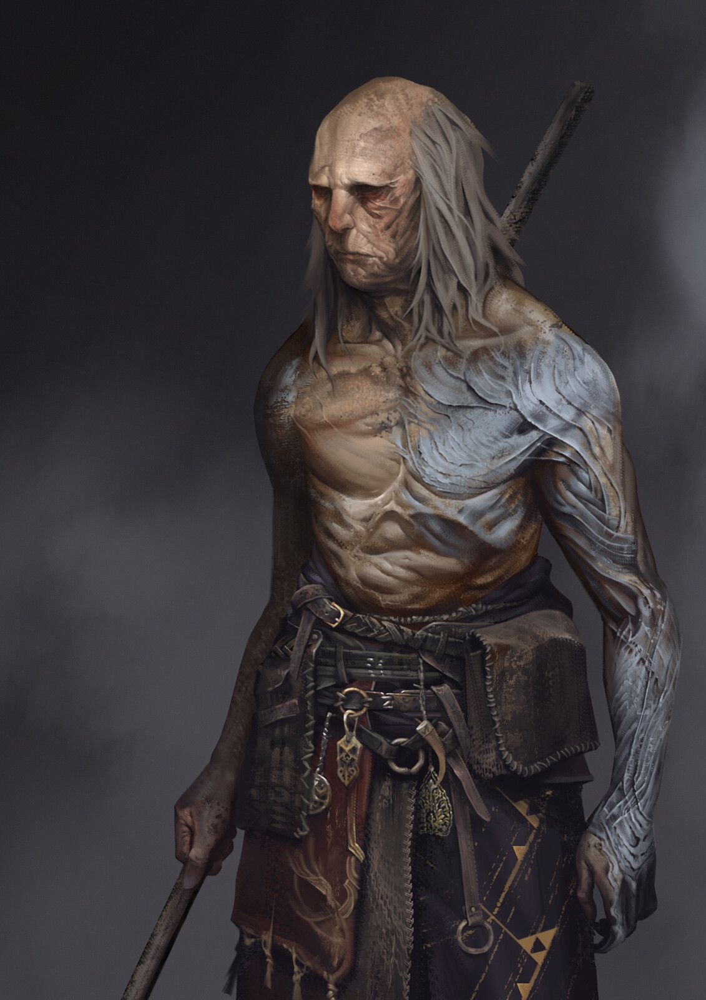

# Dawn of Blight

##### Une campagne de TTRPG inspiré des Souls aux thèmes sombres dans un univers dystopique.

## Le lore de Dawn of Blight

### Localisation et date

Dawn of Blight prend place dans un futur dystopique où la population de l'Ici, ce plan de l'existence, a été réduite à une mèche de ce qu'elle représentait autrefois par une pandémie destructrice : le Fléau.

### Les comtés du Dawn

Les comtés du Dawn représentent l'entièreté du monde connu. Parmi eux, seul un océan est connu, à l'Est du Dawn, et est jusqu'à preuve du contraire d'une superficie infinie : Le Bord de l'Ici.

Mis à part la Tour de l'Aube et le Coeur Irréel, aucun point d'intérêt n'est connu dans le Dawn : suite aux ravages du Fléau sur les comtés, les villes à haute densité de population ont disparu.

Les clusters de propagation du Fléau se multiplient, et les zones sûres disparaissent les unes après les autres. Toute forme de vie semble être au bord de l'extinction...

Partout, les humains pourrissent et meurent, et avec eux, l'humanité de ceux qui survivent. La méfiance règne et "altruisme" est un mot dont le sens est depuis longtemps oublié.

### Le Fléau

Le Fléau est une affliction maintenant répandue dans le Dawn tout entier. Les personnes affectées par le Fléau semblent souffrir jusque dans le creux de leur âme, rendues démentes par la douleur et les symptômes psychologiques de la maladie longtemps avant qu'elle ne dévore leur enveloppe corporelle.

Les populations du Dawn ont des réactions différentes lors d'épidémies du Fléau : certaines tribus de peuples reclus, terrifiés par ses effets, abattent de sang-froid leurs pairs infectés avant de se débarasser de leurs cadavres; D'autres civilisations plus clémentes banissent leurs malades dans une zone de quarantaine où ils vivront et mourront entre eux.

Il est dit qu'aucune âme dans l'Ici ou les Ailleurs ne connaît de remède ni même de traitement contre le Fléau. Il semblerait que cette peste soit inarrêtable.

## Système d'actions et de combat

Dans Dawn of Blight, le combat est dangereux, et les personnages qui ne sont pas clairement destinés à résister aux coups (comme La Brute, l'Ornementé ou le Maître d'Armes utilisant un bouclier) devront faire preuve d'agilité pour esquiver les coups (le système de combat est orienté vers l'esquive plus que sur le tanking).

Chaque tour représente 6 secondes, pendant lesquelles chaque Héros peut effectuer des actions selon des règles définies. Le personnage peut :

 - Se déplacer de 30ft (~9m)
 - Effectuer une **Action Simple** (AS), comme attaquer avec ou sans arme, se déplacer à nouveau de 30ft ou ouvrir un coffre
 - Effectuer une **Action Rapide** (AR), comme ranger une arme ou en changer, asséner un coup de pommeau ou utiliser une compétence de Héros spécifiquement désignée comme *Rapide*

OU
 - Effectuer une **Action Lente** (AL), qui lui prendra le tour entier, l'immobilisant (comme la *Méditation* de l'Adepte) ou le déplaçant différemment d'un mouvement normal (comme l'*Attaque Sautée Arrière* du Maître d'Armes)

Les Héros ont aussi une et une seule (à l'exception de l'Adepte, du Maître d'armes se remémorant sa Présence et du Corrompu souffrant l'affliction du Jumeau, qui en ont deux) **Réaction** (R) par tour de jeu, leur permettant, alors que leur tour d'action est terminé, de réagir à une attaque ennemi ou un évènement de leur choix (à la discrétion du DM), en effectuant par exemple un pas de côté pour essayer d'éviter un coup d'épée ou une flèche.

Dans de rares cas, un Héros pourra effectuer une **Action Héroïque** (AH). Ces actions sont caractérisées par le fait qu'elles nécessitent plusieurs tours pour être amenées à terme, parfois en restreignant le mouvement du Héros.

### Réactions

#### Parades

Une parade permet au Héros qui l'effectue, s'il porte un bocle, d'ajouter sa Proficiency ou sa Dextérité à sa AC. Si un coup rate de cette façon, Le héros dévie le coup et peut porter un coup en retour ou profiter d'une autre façon de la déstabilisation de son adversaire.

#### Esquives

Une esquive est une manière pour le Héros d'éviter une attaque en en ignorant la totalité des dégâts. Cette Réaction repose énormément sur le jeu de rôle mais constitue une base importante du combat dans Dawn of Blight.

#### Anticipation ("bracing")

Une anticipation est l'action de se préparer à recevoir un coup lorsqu'il est impossible de l'esquiver ou le parer. Selon le contexte, une anticipation peut réduire les dégâts subis.

## La magie dans Dawn of Blight

Dans les comtés du Dawn, la magie, bien que rare, est puissante. Cependant, peu connaissent réellement ses origines : elle se repose en réalité sur la perturbation des frontières entre le plan d'existence sur lequel le Dawn se trouve et les autres, respectivement appelés par les initiés l'*Ici* et les *Ailleurs*.

C'est pourquoi les fanatiques de Ganagoth, une caste sectaire prêchant la parole d'un hypothétique être surpassant les frontières entre les Ailleurs, méprisent l'arrogance et l'élitisme des apprentis et érudits de la Tour de l'Aube car ceux-ci sont convaincus d'avoir la capacité de conjurer des sorts naturellement sans perturber l'équilibre de ces frontières.

Certains peuples nient l'existence de la magie dans son ensemble, comme les moines qui ne croient qu'en leur divinité et pense que les capacités des mages sont des dons de sa part.

## Liste des armes et boucliers

 - La plupart des armes de départ sont tirées de [ce site web](https://www.dandwiki.com/wiki/5e_SRD:Weapons).
 - Elles gardent leurs statistiques de base, si ce n'est le poids qui est géré différement dans Dawn of Blight.
 - Les Armes Super-Lourdes prennent une AS à dégainer, et les autres une AR. Les Armes de lancer Légères peuvent être dégainées et lancées en une seule AS. Sinon, deux AR peuvent être utilisées pour les dégainer puis les jeter.
 - Sont considérées "à distance" les armes utilisables seulement à distance.
 - Sont considérées "martiales" les armes définies comme telles dans le lien présent ci-dessus ou, pour celles qui en sont absentes, à la discrétion du DM. Les armes martiales sont restreintes au Maître d'Armes, l'Exilé, l'Ornementé et le Fou grâce à la compétence passive *Entraîné*.
 - Seuls le Maître d'Armes et l'Ornementé peuvent utiliser des boucliers simples grâce à la compétence passive *Protecteur*, et seul l'Ornementé peur porter ceux des catégories des martiaux et des Super-Lourds, grâce à la compétence passive *Muraille*. Porter un bouclier ou un bocle restreint les mouvements des Héros, ce qui est traduit dans Dawn of Blight par une limitation qui n'est évitable dans aucun cas d'une seule Réaction par tour. Les bocles n'accordent pas ou peu d'AC quand portés, mais permettent de parer et riposter aux coups (cf la section sur les parades dans "Système d'actions et de combat").
 - Les armes et boucliers n'ayant pas de stats proviennent du lien présent ci-dessus, leurs stats sont donc disponibles là-bas. Celles en ayant sont donc importées d'autres sources, des versions modifiées d'armes du lien ou sont crées de toutes pièces par moi-même.
 - Les armes et boucliers "désarmants" confèrent un avantage lors d'une tentative de désarmement dû à leurs formes.

Concernant les armes Super-Lourdes de mêlée :

 - Les armes "lentes" utilisent des AL au lieu d'AS, et des AS au lieu d'AR.
 - Les dés des armes "fiables" sont roulés à nouveau si tous tombent sur un 1.
 - Les dés de dégâts des armes avec le modificateur "Momentum" sont explosifs : ils sont roulés à nouveau en ajoutant les dégâts s'ils tombent sur la valeur maximale.

### Armes de mêlée

#### Armes Super-Lourdes de mêlée

Cette catégorie d'armes est restreinte d'utilisation à La Brute.

 - Maul : 1d12+1d4 contondant - Fiable <!-- total : 16+1, min 3 - a perdu le +1 au profit d'un Fiable (moins fort) car le d4 est plus reliable donc elle n'a plus besoin d'un aussi gros buff qu'avant -->
 - Lance de cavalerie : 4d4 perçant <!-- total : 16, min 4 -->
 - Massue lourde : 4d4 contondant <!-- total : 16, min 4 -->
 - Gantelets : 2d8 contondant - Fiable <!-- total : 16, min 3 -->
 - Hache géante : 3d8 tranchant - Lent - Momentum <!-- total : 24, min 4 -->
 - Tueur de dragons : 4d6 contondant - Lent - Momentum <!-- total : 24, min 4 -->
 - Fléau Hydre : 5d6 contondant - Lent <!-- total : 30, min 5 -->
 - Marteau Brise-roche : 3d10+1 contondant - Lent <!-- total : 30+1, min 4 -->
 
<!-- Valeurs basses :

 - Maul : 1d12+1 contondant : total 12+1, min 2
 - Lance de cavalerie : 3d4 perçant : total 12, min 3
 - Massue lourde : 3d4 contondant : total 12, min 3
 - Gantelets : 2d6 contondant - Fiable : total 12, min 3
 - Grande hache : 3d6 tranchant - Lent - Momentum : total 18, min 3
 - Tueur de dragons : 3d6 contondant - Lent - Momentum : total 18, min 3
 - Fléau quadruple : 4d6 contondant - Lent : total 24, min 4
 - Marteau Brise-roche : 2d12+1 contondant - Lent : total 24+1, min 3
 
 mais c'était pas assez fort par rapport aux armes lourdes normales
 
 -->
 
<!-- plus de petits dés = reliable donc plus de dégâts en moyenne que peu de gros dés, donc le second cas est buff pour égaliser. voir https://dice.clockworkmod.com/ et https://www.reddit.com/r/dndmemes/comments/clplas/an_analysis_of_1d12_vs_2d6_and_3d4_after_1000000/ -->
 

#### Armes simples de mêlée

##### Armes Lourdes :

 - Masse d'armes

##### Armes Moyennes :

 - Massue
 - Bâton
 - Lance
 - Arbalète légère

##### Armes Légères :

 - Dague
 - Hachette
 - Javelot
 - Marteau court
 - Couteau de lancer
 - Arc court
 - Fronde
 - Faucille
 

#### Armes martiales de mêlée

##### Armes Lourdes

 - Hache de combat
 - Fléau
 - Fauchard : 1d10 tranchant *ou* perçant
 - Grande épée
 - Hallebarde : 2d4 tranchant *ou* perçant
 - Étoile du matin
 - Pic
 - Pic de guerre
 - Arbalète lourde
 - Arc long
 - Cordelame : 1d8 tranchant

##### Armes Moyennes

 - Épée longue
 - Rapière
 - Cimeterre
 - trident
 - Fouet
 - Khopesh : 1d6 tranchant - Désarmant

##### Armes Légères

 - Épée courte : 1d6 tranchant *ou* perçant
 - Sarbacane : 1d2 perçant
 - Arbalète à main
 - Dague de parade : 1d4 perçant - Désarmant

### Armes à distance

#### Armes simples à distance

##### Armes Moyennes :

 - Arbalète légère

##### Armes Légères :

 - Javelot
 - Couteau de lancer
 - Arc court
 - Fronde

#### Armes martiales à distance

##### Armes Lourdes

 - Arbalète lourde
 - Arc long

##### Armes Moyennes

 - Tromblon : portée conique 10ft (3m), 2d4 perçant *ou* contondant (en fonction du type de munition)

##### Armes Légères

 - Sarbacane
 - Arbalète à main

### Boucliers

#### Boucliers Super-Lourds

- Serpent d'Argent : +5 AC pour les attaques de dos, +1 pour les autres. Ce bocle est fixé sur un bras d'armure, dont un extension s'enroule autour de l'épaule du porteur et fond en cape articulée à l'arrière, protégeant le dos. Il nécessite une AL pour être porté ou retiré et inflige un malus limitant le porteur à 25ft par tour de vitesse de base.
- Fer Déchu : +7 AC. Est de forme oblique, protégeant en arc de cercle le front du porteur. Restreint les mouvements à 10ft par tour.

#### Boucliers simples

##### Boucliers lourds :

- Pavis : +5 AC, Ne peut être utilisé que lorsque placé devant soi (prend une AS).
- Scutum : +4 AC, Peut être porté à une main, Restreint les mouvements à 10ft par tour.

##### Boucliers moyens :

- Bouclier en bois : +1 AC, Explose après 20 dégats, inflammable.
- Écu : +2 AC, Se brise après 30 dégâts ou 20 en une seule attaque.
- Targe : +1 AC, Se brise après 30 dégats, Permet de tenir une lance à une seule main mais limite les déplacements à 15ft par tour.

#### Boucliers martiaux

##### Boucliers lourds :

- Arbalétrier bouclier : 2d6+1d4 perçant - Lent, Tire des carreaux, +2 AC, Le bouclier se brise après 25 dégâts ou 20 en une attaque. L'arbalétrier est toujours utilisable.
- Bouclier creux : +4 AC. Peut être frappé d'une arme contondante pour effectuer un son qui inflige moitié moins de dégâts de force à toutes les créatures à 20ft à la ronde non préparées.

##### Boucliers moyens :

- Bouclier lanterne : +1 AC, Se brise après 25 dégâts, Émet de la lumière jusqu'à 30ft, Permet de porter un objet dans la main qui le porte, Les attaques effectuées avec la main qui le porte font 1d6 de dégât contondant.
- Bouclier projeté : +2 AC, Se désactive après 20 dégâts jusqu'au prochain repos long, Se brise après 20 dégâts en une seule attaque, Peut être activé ou désactivé avec une AR.
- Bouclier aimant : +2 AC, Se brise après 30 dégâts ou 20 en une seule attaque, Attire tous les objets en métal à moins de 10ft avec une force douce et 5ft avec une force puissante. les ennemis tenant des armes ou portant des armures de métal doivent effectuer un jet de constitution avec un DC de 4 pour ne pas perdre leur arme ou trébucher et de 10 pour ne pas dévier vers le bouclier si la force est douce. Si elle est puissante, les DC sont de 8 et 14.

### Bocles

Les bocles permettent d'effectuer une parade.

#### Bocles simples

##### Bocles moyens :

- Bocle de métal : +1 AC. Empêche de porter une arme à deux mains.

##### Bocles légers :

- Bocle réduit de métal

#### Bocles martiaux

##### Bocles moyens :

- Bocle lanterne : Émet une lumière jusqu'à 30ft à la ronde.
- Bocle de mage : permet de parer un coup jusqu'à 10ft de distance, pour se protéger soi ou un allié.

##### Bocles légers :

- Bocle réduit miné : Explose à la première parade sans se briser, infligeant 2d4 de dégâts de feu à l'attaquant sur un lancer de dextérité raté, et 1d4 sur un lancer réussi. Il se comporte ensuite comme un Bocle réduit de métal.
- Bocle réduit pointu : Présente une pointe qui peut être utilisé comme arme lors d'une AR pour infliger 1d4 de dégâts contondants.

## Les Héros de Dawn of Blight

##### Les descriptions ici présentes des compétences ne comportent pas, pour la plupart, de valeurs numériques. Les valeurs sont disponibles sur les arbres de compétences.

### Le Maître d'armes

##### Le Maître d'armes est un guerrier expérimenté et durci par la guerre, dont l'expérience de combat peut être mesurée au nombre de cicatrices. Son expertise des armes de mêlée lourdes est inégalable.

#### Passifs au niveau 0 :

 - *Harnaché* : Le Maître d'armes est le seul personnage possédant plus de deux emplacements d'armes. Il est équipé de :
   - Un crochet dorsal, qui peut accueillir une arme lourde ou une arme moyenne
   - Un fourreau de hanche, qui peut accueillir une arme moyenne ou deux armes légères
   - Un fourreau lombaire, qui peut accueillir une arme légère à l'horizontale.
	
 - *Protecteur* : Le Maître d'armes est le seul, mis à part l'Ornementé, à pouvoir utiliser des boucliers et des bocles. Lorsqu'il porte un bouclier (et non un bocle), le Maître d'Armes ne peut avoir qu'une *Réaction* par tour, même si des compétences l'affectant indiquent le contraire.
 - *Forgé par la guerre* : Le Maître d'armes, fort de son expérience au combat, a un bonus naturel de +2 à tous les jets d'attaque en mêlée.
 - *Polyvalence* : Les arbres de compétence du Maître d'armes se rejoignent à chaque niveau et ne requièrent pas d'adjacence avec la dernière compétence choisie, lui permettant de choisir n'importe quelle compétence disponible lors du passage d'un niveau.

#### Compétences Actives au niveau 0 :

 - *Feinte* : Le Maître d'armes est capable de déceler le potentiel d'une arme qu'un simple mercenaire ne verrait pas. Il peut donc utiliser son Action Rapide en plus de son Action Simple lorsqu'il attaque, pour attaquer avec un avantage.
<!-- TODO autres compétences actives ? -->

#### Arbres de compétences :

Le Maître d'armes a accès à quatre arbres de compétences :

 - *Souvenirs de l'Art de Combat* : Cet arbre permet au Maître d'armes de se remémorer des techniques qu'il a apprises au cours de sa vie. C'est ici que vous trouverez de nouvelles compétences requérant de l'agilité et de la maîtrise des armes. <!-- genre tournoyer avec l'arme etc -->
 - *Souvenirs de Force* : Cet arbre contient tous les souvenirs des exploits de force que le Maître d'armes a un jour atteint. Dans cet arbre de compétences, vous trouverez des compétences nécessitant de la force brute, utiles en combat comme ailleurs. <!-- techniques genre briser une garde avec une arme lourde, ou une porte avec un coup de pied. Actions Lentes -->
 - *Souvenirs de Robustesse* : Cet arbre représente tous les souvenirs des jours anciens où le maître d'arme était solide. Vous retrouverez ici des compétences améliorant la longévité du Héros ou permettant de faire de lui le centre d'attention des rangs ennemis. <!-- (tank, taunting -->
 - *Souvenirs de Présence* : Cet arbre est rempli de souvenirs de jours où le Maître d'armes a prouvé ses capacités sur le champ de bataille, faisant résonner son nom dans toutes les bouches des comtés du Dawn. Il présente les compétences permettant au Héros de combattre contre des ennemis multiples et d'utiliser son aura elle-même comme une arme. <!-- capacité à gérer plusieurs ennemis en même temps et force psychologique -->

#### Équipement de départ :

Emplacements : 

 - Crochet dorsal : Une arme lourde ou une arme moyenne
 - Fourreau de hanche : Une arme moyenne ou deux armes légères
 - Fourreau lombaire : Une arme légère

### Le Corrompu

##### Le Corrompu est un mercenaire au triste destin, dont le corps et l'âme furent infectés par une Entité venue d'un Ailleurs inconnu lors d'une mission qui tourna mal.

#### Passifs au niveau 0 :

 - *Deux fois deux yeux* : L'Entité ayant une conscience et une perception du monde propre à elle, elle peut aider le Corrompu en le prévenant parfois des dangers qui l'entourent ou des avis qu'elle a sur des situations ou des personnages. <!-- Il gagne occasionnellement aussi un bonus de +1 aux jets de sagesse --> 
 - *Ouïe du vide* : L'Entité sent les perturbations entre les Ailleurs et peut prévenir le Corrompu d'éventuelles tentatives d'attaques magiques.
<!-- TODO actifs arbre de compétence :  - *Enveloppe Instable* : Le Corrompu est capable de repousser violemment une personne qui touche sa peau nue d'une onde de choc envoyée par l'Entité.
 - *Sacrifice Protecteur* : L'Entité sacrifie une partie de son être pour boucher un portail ouvert par un sort ennemi, l'empêchant d'exister dans l'Ici. -->

#### Compétences actives au niveau 0 :

 - *Perturbation mineure* : AS. Le Corrompu perturbe légèrement l'équilibre entre l'Ici et les Ailleurs dans un point donné que peut atteindre l'Entité tendant le bras. Cette zone reste à cet endroit un tour, et tout personnage dont la tête la traverse est perturbé, voyant un court instant la frontière entre le réel et l'impossible se brouiller. Il est donc objet d'un désavantage dans tous ses jets de perception et de réaction. <!-- niveaux suivants : plus longtemps OU plus gros, et l'un ou l'autre pas les deux -->
<!-- TODO autres-->

<!-- tp ou portail / passer à travers mur / coup de main : main de l'entité au même endroit que main du corrompu --> 

#### Arbres de compétences :

Le Corrompu a accès à trois arbres de compétences :

 - *Affliction du condamné* : Cet arbre, qui représente la force de l'Entité habitant le Corrompu, contient des compétences puissantes mais qui forceront le Héros à s'abandonner à chaque fois un peu plus à elle, décuplant son pouvoir en en payant le prix : son humanité.
 - *Affliction du jumeau* : Le Corrompu empreintant ce chemin apprend à cohabiter avec l'Entité et établit une communication qui lui apporte des compétences stratégiques et de reconnaissance, dont l'efficacité est démultipliée par les deux esprits l'habitant.
 - *Affliction du démoniste* : Cet arbre représente la volonté du Corrompu. Il propose des compétences qui lui permettront de maîtriser l'entité, la réduisant à un simple outil, révélant des sorts de divination et de dématérialisation techniques qui se reposent sur la complexité de la conscience humaine et permettront au Corrompu de quitter son enveloppe corporelle.

Les arbres du Corrompu se rejoignent à certaines compétences "ponts" :

 - *Afflictions du Condamné et du Jumeau* : Ces compétences demandent au Corrompu de laisser l'Entité prendre le contrôle pendant un temps tout en restant conscient.
 - *Afflictions du Jumeau et du Démoniste* : À l'inverse, ces compétences permettent au Corrompu de puiser dans les pouvoirs bruts de l'Entité et de s'échapper un instant des limites de son corps humain sans pour autant l'abandonner.

### L'Érudit

##### L'Érudit est un prodige de la Tour de l'Aube, formé dans les arts des quatre écoles de magie.

#### Passifs au niveau 0 :

 - *Élève modèle* : Le mage est intelligent, et a longuement étudié dans l'anticipation de ses missions pour la Tour. <!-- Il possède un bonus de +1 à tous les jets d'intelligence --> 
 - *Entraînement Psionique* : Le mage, fort de son entraînement dans la Tour, possède une résistance accrue aux attaques mentales. <!-- désavantage contre lui -->

#### Compétences actives au niveau 0 :

 - *Séparation* : AS. L'Érudit peut écarter violemment des objets d'un même élément ou briser un objet déjà fragile.
 - *Flèche élémentale* : AS. L'Érudit est capable de conjurer une flèche grossière d'un élément de son choix.
 - *Courage* : AS. L'Érudit sait user de ses mots et de ses pouvoirs pour agir sur la perception d'un allié, lui permettant de faire abstraction de dommages pris pendant un instant. <!-- pv temporaires vraiment temporaires genre +3 HP pendant 3 tours -->
 - *Suggestion* : AR. L'Érudit peut utiliser sa magie pour appuyer ses propos et les faire sembler plus convaincants à qui les entend.

#### Arbres de Compétences :

L'Érudit a accès à quatre arbres de compétences correspondant aux quatre écoles de la Tour de l'Aube :

 - *École de la destruction* : Cet arbre de compétences, représentant des sorts utilitaires enseignés dans la Tour mais détournés par ses apprentis, contient des sorts capable de détruire, d'une façon ou d'une autre, des éléments présents autour de l'Érudit. Ces sorts sont dangereux, et demandent de la part des érudits un bon niveau de contrôle d'eux-mêmes pour ne pas mal finir. <!-- Plus les sorts sont puissants puis il perd le contrôle -->
 - *École du mimétisme : Cet arbre contient les sorts les plus artistiques de la Tour. La déformation des éléments qui les entourent permettent aux érudits de forger le monde à leur bon vouloir. Malheureusement, personne n'est assez puissant pour combiner taille, durée, solidité et finesse dans un seul sort. <!-- (contrôle des éléments pour autre chose que de la destruction, genre des cages) - t'es obligé de perdre soit la taille de ces constructions, soit leur durée, leur solidité ou leur précision -->
 - *École de l'ouverture* : Cette école est celle des altruistes, aussi peu nombreux qu'ils soient dans l'environnement orgueilleux et élitiste de la Tour de l'Aube. Elle enseigne aux apprentis des sorts de soin, d'aide et de protection. <!-- (soin, buffs, armures) -->
 - *École du contrôle* : Cet arbre représente l'enseignement dispensés aux apprentis de la Tour concernant les esprits. Il présente des sorts orientés vers le contrôle du psyché et la manipulation. Les sorts les plus puissants demandent aux érudits de se concentrer, faisant abstraction de leur alentours. <!-- Plus les sorts sont puissants plus ils demandent de concentration, le coupant du monde -->

<!-- sort double jump : plateforme en air qui dure un tour ? pour que qqn d'autre saute dessous ou lui-même -->

Les quatre arbres de compétences de l'Érudit se rejoignent à certains sorts, partagés entre les écoles. <!-- 
destruction / mimétisme : bombes élémentales
mimétisme / ouverture : armures
ouverture / contrôle : liaisons entre les esprits de ses potes (entre eux ou avec ses adversaires ou même les adversaires entre eux), débuffs ennemis -->

### La Brute

##### La Brute est un ogre monstrueux aux origines volcaniques singulières, qui frappe avant de parler et agit avant de réfléchir.

#### Passifs au niveau 0 :

 - *Taille Gargantuesque* : La Brute est énorme, lui permettant de s'interposer au milieu d'un combat ou d'une zone de taille réduite pour changer le cours de l'action. Cependant, cette taille peut s'avérer problématique dans des situations nécessitant de la discrétion ou de l'agilité. <!-- malus de -2 sur les jets de discrétion et bonus de +2 sur les jets de constitution -->
 - *Force de Goliath* : La Brute, de par sa taille et ses origines guerrières, est capable de prouesses de force qu'un humain n'atteindrait jamais, même avec de l'entraînement, sans l'intervention de la magie.  
La Brute est le seul Héros capable de porter les armes de la catégorie ultra-lourdes, telles que les marteaux brise-roche, les massues montagnes, les gantelets, *etc*. <!-- +2 sur les jets de force aussi -->
 - *Sang Chaud* : La Brute tient difficilement en place : Il est difficile pour elle de ne pas s'énerver lorsque provoquée, par exemple. <!-- justifie aussi le même malus de -2 sur la discrétion et désavantage sur les jets de sagesse lorsque provoqué -->

#### Compétences actives au niveau 0 :

 - *Éruption* : AS. La Brute entre dans un état de rage aveugle et alors que son coeur bat à une vitesse folle, son sang se met à bouillir. Dans cet état, la peau de la brute est rouge et fumante, et des jets de vapeur s'échappent de ses pores. La Brute est incapable de tenir une arme en bois ou en métal sans la détruire, mais obtient un bonus de dégâts et de constitution considérables grâce à cette montée d'adrénaline -- non sans en payer le prix ensuite. Sortir de cet état consomme une AR. 

#### Arbres de compétences :

La Brute possède deux arbres de compétences :

 - *Descendance Monstrueuse* : Cet arbre contient des compétences liées à la descendance d'ogre de La Brute, qui lui permettront de mettre à l'oeuvre sa force dans des épreuves de destruction et de dégâts bruts. C'est aussi ici qu'il acquerra la capacité de terrifier ses adversaires lors de ses excès de rage comme en dehors.
 - *Descendance Volcanique* : Cet arbre de compétences correspond à la descendance de brasier de La Brute. C'est dans celui-ci que vous trouverez des compétences lui permettant d'améliorer ses dégâts de feu et de chaleur, de produire plus de dégâts lors de sa compétence *Éruption* et de mieux y résister lui-même.
<!-- citation de shakespeare intelligence mdr dans une compétence complètement hors-sol -->

### L'Adepte

##### L'Adepte est un pieux moine guidé par sa foi. Sa spiritualité est l'origine de sa force et fait de lui la preuve vivante que cette force peut prévaloir sur celle du corps. Les arts martiaux aident pas mal.

#### Passifs au niveau 0 :

 - *Un esprit sain dans un corps sain* : L'Adepte est frêle, mais sa foi est robuste, et rien ne peut l'ébranler. L'Adepte a **très** peu de points de vie mais chacun de ces PV est protégé par des points de *Foi*, qu'il peut récupérer en *Méditant*. <!-- compétences Un esprit sain dans un corps sain II - III - IV : 7, puis 10, puis 12 PF par PV -->
 - *Sixième sens* : L'Adepte est de nature calme et observatrice. Il peut réagir deux fois par tour aux actions adverses.
 - *No Stress* : L'Adepte ne gâche aucune goutte de sueur dans des mouvements surperflus, et aucune seconde passée à bouger ne l'est en vain. L'Adepte peut utiliser une AS et deux AR par tour. <!-- compétence No Stress II : il peut utiliser une fois une AR en tant qu'AS une fois par short rest-->
 - *Je Connais Le Kung-Fu* : L'Adepte est un artiste martial aguerri et sa foi lui proscrit d'utiliser des armes. Il ne peut donc se battre qu'à mains nues, mais jouit d'un bonus de dégâts dans cette pratique.

#### Compétences Actives au niveau 0 :

 - *Méditation* : AL. L'Adepte s'assoie en tailleur et fait abstraction totale du monde qui l'entoure. Dans la tranquilité, il trouve la plénitude, ainsi que tous les Points de Foi perdus pour le PV actuel. La *Méditation* est interrompue par une attaque. <!-- Méditation II : si déjà à fond dans la foi d'un PV, il peut récupérer un autre PV avec 0 de foi en méditant -- Méditation III : la méditation lui laisse quand même une réaction par tour, qui brise la méditation aussi, mais au moins ne lui fait pas perdre de PV s'il parvient à esquiver -- Méditation IV : Il récupère tous les PF ET le PV avec 0 de foi quand il médite -->

#### Arbres de compétence :

 - *Voie du corps* : Cet arbre de compétence représente l'entraînement assidu que l'Adepte a suivi pour faire de son enveloppe charnelle le récipient parfait pour un esprit robuste. Il contiendra des compétences lui permettant d'augmenter les dégâts produits à chaque tour, souvent en attaquant de manière répétée.
 - *Voie de l'esprit* : Cet arbre contient toutes les compétences relatives à la concentration hors-normes de l'Adepte. S'y trouvent des compétences actives et passives relatives à celle-ci, qui lui permettront de résister aux dégâts psychiques ou de lire les mouvements de ses adversaires.
 - *Voie de la foi* : Cet arbre contient les compétences liées à la foi inébranlable de l'Adepte, comme des prières accordant des protections divines ou des aides en combat.

Les arbres de compétences se rejoignent sur certaines compétences ponts, qui mêlent les caractéristiques de deux arbres.

<!-- chaque dégât = 2 points de volonté ? maybe prière qui fait que chaque dégât = 1 point de volonté ? -->

### L'Exilé

##### L'Exilé est un marin épéiste originaire d'une île de l'Archipel des Météores à l'Est des comtés du Dawn, dans le Bord de l'Ici. Son passé est brumeux, mais il ne tient pas son nom de nulle part.

#### Passifs au niveau 0 :

 - *Iaido* : L'Exilé a pratiqué le *Iaijutsu*, ou l'étude de l'art de dégainer le sabre, et obtient un considérable bonus lorsqu'il attaque en premier, par surprise ou par opportunité.
 - *Calme du loup* : L'Exilé, dans sa vie de pêcheur, a appris à ne pas effrayer ses prises. Il est particulièrement silencieux lorsque la situation l'impose et sait tirer profit de ses capacités de discrétion. Il est aussi, de ce fait, plus facilement caché dans la fumée et la brume.
 - *Grimpeur* : L'Exilé a passé sa vie de marin à escalader les mâts et les échelles de cordes des bateaux voguant sur le Bord de l'Ici. Il est agile et sait faire profit de toutes les accroches présentes sur une surface pour y grimper avec plus de facilité. Il est aussi capable de monter des murs plus hauts que ce dont la moyenne est capable. <!-- Grimpeur II : L'Exilé obtient une corde au bout de laquelle est attachée un poids en métal, lui permettant de swing sur toutes les poutres et autres barres qu'il trouve, ou de grimper sur un mur surplombé d'un poteau vertical. En combat, la détacher de sa ceinture utilise une AS -- Grimpeur III : La corde de l'Exilé est enfilée dans une manchette autour de son bras, lui permettant de la dégainer rapidement, même en combat avec une AR. Il peut maintenant aussi s'en servir pour des attaques de type lasso et swing en plein combat -- Grimpeur IV : L'Exilé remplace sa corde - et son bras droit - par une prothèse à ressort chargée d'un grappin en métal, qui lui permet (à l'aide d'une AR en combat) de tirer ce grappin dans une surface, aussi dure que du bois ou aussi fragile qu'un torse humain. il lui faut une AS pour rétracter son grappin avec une petite manivelle, ou une AL s'il s'agit de tracter un poids, comme un corps -- Grimpeur V : La prothèse de l'Exilé est maintenant chargée d'un moteur qui rétracte violemment le grappin au lieu d'une manivelle. Il peut donc le rétracter avec une AR, ou une AS s'il s'agit de tracter un poids. -->

#### Capacités actives au niveau 0 :

 - *Sprint Estoc* : AS. L'Exilé sprinte en avant (en plus de son déplacement) et saute l'épée tendue, dans un mouvement perforateur. Ce coup peut percer les armures de cuir. <!-- compétence II : Sprint Croissant : AS, l'exilé sprinte en avant et slice à l'horizontale, dans un coup moins puissant que le sprint estoc mais qui permet de couper plusieurs ennemis en même temps -- compétence III : Sprint Balayeur : AS, l'exilé sprinte en avant et slice à l'horizontale tout en glissant en coupant les chevilles de ses adversaires -->
 - *Bombe Fumigène* : AR. L'Exilé jette une bombe fumigène sous ses pieds, qui explose instantanément. Toute personne dans un rayon de 5 pieds du point d'impact gagne une immunité aux attaques d'opportunité et les attaques (qui ne sont pas des attaques de zones) sur eux ont un désavantage. L'Exilé peut utiliser une AS pour l'envoyer autre part, à distance maximale de 30ft (9m). Cette compétence est disponible 2 fois par long repos, puis 3, 4 et 5 au niveaux II, III et IV de compétence. <!-- compétence bombe tout court, bombe à eau (inoffensive), bombe à poivre (lacrymo), bombe à huile (glissante), bombe à toiles d'araignées (collante) -->

<!-- grappin, tyrolienne quand amélioré -->

#### Arbres de compétence :

L'Exilé a accès à trois arbres de compétences :

 - *Quête du loup solitaire* : Cet arbre de compétence représente les capacités de sabreur de l'Exilé qui lui ont valu son nom. Les compétences présentes ici se concentrent donc sur cet art, dans l'offense comme la défense ou l'esquive.
 - *Quête de l'harmonie* : Cet arbre représente la quête intrinsèque de paix et de pardon de l'Exilé. S'y trouvent des compétences alliant ses origines marines et l'art de l'épée ou lui conférant des compétences passives pouvant l'aider en combat.
 - *Quête du loup de mer* : Les compétences présentes dans cet arbre sont liées aux origines marines de l'Exilé et lui conféreront un avantage tactique certain en combat grâce aux avancées technologiques de son peuple.

Ses arbres de compétences se rejoignent régulièrement sur des compétences ponts, qui permettent un passage d'un arbre à l'autre.

### Le Martyre

##### Le Martyre, protecteur de la faune et la flore de son comté, est un être aussi puissant que souffrant qui a depuis longtemps oublié le sens du mot "humain", car il n'en a pas vu depuis longtemps, ni dans ses terres ni dans son reflet. Personne ne connaît son passé, pas même lui : après des dizaines -- centaines ? -- d'années immobile dans la forêt, la nature a repris ses droits, meurtrissant son corps et son esprit.

#### Passifs au niveau 0 :

 - *Cécité* : Les yeux du Martyre sont percés de ronces, le rendant aveugle, mais il a appris dans son sommeil à entendre le chant du monde qui l'entoure. Bien qu'il ne puisse lire ou voir les couleurs, il est étranger aux concepts de lumière et d'ombre et voit avec la même clarté même dans le noir.
 - *Arrachures* : Le Martyre est couvert de ronces, des yeux aux mains, du dos aux jambes. Ces ronces, si elles forment un bouclier naturel contre les attaques non-armées et qui impliquent l'utilisation de fibres, l'entravent aussi dans ses actions en combat, l'heurtant lorsqu'il tente des attaques de mêlée. Elles apportent aussi un bonus de dégâts à ses propres attaques non-armées (qui l'heurtent aussi !).
 - *Nature Instable* : La flore retenant le Martyre prisonnier est instable et bien qu'elle le fasse souffrir, ne laissera pas l'être qu'elle parasite mourir. En *Réaction* à une attaque, Lancez un d4 :

| Résultat du dé | Réaction |
| --- | --- |
| 1 | L'arme ou le membre de l'attaquant reste coincé dans des ronces autour du Martyre. Dans le cas d'une arme, l'ennemi est désarmé; Dans le cas d'un membre, l'ennemi est restreint de rester adjacent au Martyre, voit ses dégâts contre lui divisés par 2 et doit effectuer un jet de force au début de chacun de ses tours. En cas d'échec, il prend 1d2 de dégâts perçants, reste coincé, puis commence son tour. En cas de succès, il s'extirpe des ronces. Si l'attaque était à distance, aucun de ces effets ne s'applique mais le Martyre broie la munition dans son organisme et récupère 1 PV après l'attaque. |
| 2 | Les plantes parasitant le Martyre font exploser leurs bourgeons, propulsant une fumée toxique sur les yeux de l'adversaire, entravant sa vue. Pendant le prochain tour, il effectue tous ses jets de perception (et autres jets nécessitant la vue, à la discrétion du DM) et d'attaque avec un désavantage. |
| 3 | Une plante explosive est touchée par l'attaque de l'adversaire et envoie des graines explosives sur celui-ci. Si l'adversaire ne porte pas de gants ou d'armure couvrant son visage, ses mains ou son torse, ces graines se plantent dans sa peau, et explosent au début du prochain tour du Martyre, infligeant 1d8 de dégâts de poison, puis disparaissent. Si l'attaque était non-armée, l'adversaire prend à l'impact 1d6 de dégâts perçants, et le Martyre la moitié de ces dégâts. |
| 4 | L'attaque touche une germe infectée qui détruisait le corps du Martyre. Roulez un d6. Sur un 5, le Martyre ne prend que la moitié des dégâts reçus. Sur un 6, le Martyre n'en prend aucun. Autrement, le Martyre prend les dégâts comme donnés par l'attaque. |
<!-- Nature Instable II : si le martyre prend plus de 15 dégâts d'un coup, il roule 2 fois -- III : si le martyre prend 25 dégâts d'un coup, il roule 3 fois -->

- *Sacrifice* : Le Martyre est déchiré par les années de destruction par la nature. Plus il souffre, plus il peut produire de dégâts.
 - *Faune Empathique* : La faune comprend la souffrance du Martyre et est plus prompte à suivre ses chants et ses paroles. <!-- proficiency à jets de animal handling -->
 - *Flore Apathique* : La flore, bien qu'elle soit la source de ses souffrances, est connue du Martyre. Il sait faire profit de ces connaissances. <!-- proficiency à jets de Nature et Survival -->

<!-- *Phoenix* : Si le Martyre subit un coup fatal, il peut une fois par Repos Long survivre avec 4 PV en produisant (ou non, selon son choix) une explosion de poison et de ronces déchirées qui inflige 2d6 de dégâts de poison et 2d6 de dégâts tranchants à tous les personnages à moins de 15ft (5m). -->

#### Compétences actives au niveau 0 :

 - *Trêve* : Le Martyre puise dans la force de son parasite et recouvre un membre de son corps d'écorce, offrant une immunité aux attaques contondantes et à sa capacité passive *Arrachures* (qui fait toujours effet sur ses adversaires !) pour ce tour. Il gagne 2 AC contre les attaques tranchantes. Les attaques perçantes ne sont pas affectées par cette compétence. <!-- Trêve II : Le membre devient de la racine brute, réduisant les dégâts tranchants de moitié en plus du +2 AC, et +2 AC aux perçants -- Trêve III : Le membre devient de la pierre, devenant immun aux dégâts tranchants et réduisants les dégâts perçants de moitié en plus du +2AC. -->

<!-- *Effet Papillon* : morceaux de lui s'envolent en tant que papillons et il perd de la vie constamment, mais pour chaque qu'il récupère il reprend de la vie, niveau supérieur ses potes peuvent le récupérer. -- *Cri De Douleur* : Le Martyre écrase ses paumes sur les ronces plantées dans ses yeux dans une explosion de sang, et émet un beuglement primitif qui s'entend à des dizaines de mètres à la ronde. Tous les personnages à moins de 30ft (9m) autour de lui sont effrayés et les animaux et créatures non-intelligentes à moins de 150ft (45m) s'enfuient ou s'envolent. Toutes les créatures intelligentes à moins de 150ft sont alertées. -- *Golemine* : Invoque un petit golem de pierre à partir de cailloux et galets présents à moins de 30ft (9m) du Martyre. Ce golem joue ses tours après ceux du Martyre et n'effectue que deux actions : il se dirige à chaque tour vers l'ennemi le plus proche sur 15ft (5m), et explose lorsqu'à moins de 5ft d'un ennemi. Cette explosion cause 2d4 de dégâts contondants à tous les personnages, ennemis comme Héros, à 5ft ou moins. -- Tréant -- Rat -- Guêpes / Frelons -- Farfadet malicieux : timebomb qui crie ou pleure pour attirer les ennemis qui ne le voient pas, s'ils le voient ils ne sont pas bernés. -->

#### Arbres de compétences :

 - *Naissance* : Cet arbre de compétences se concentre sur les compétences druidiques du Martyre, lui permettant de créer des poisons, des êtres amalgamant magie et flore et des plantes.
 - *Souffrance* : Cet arbre de compétences contient toutes les compétences relatives à l'affliction du Martyre. S'y trouveront toutes les capacités liées au sacrifice et à la force qu'il gagne lorsqu'il perd de la vie.
 - *Essence* : Cet arbre est lié aux compétences d'appel et de communication du Martyre, lui permettant de parler aux êtres vivants qui l'entourent, d'attirer les animaux et d'en contrôler l'esprit et de maîtriser la pousse des plantes avec lesquelles il résonne.

### L'Ornementé

##### L'Ornementé n'était qu'un simple garde d'élite du village d'Aléa avant qu'un combat dévastateur entre deux archimages au cours duquel fut lancé le sort *Fusion Morbide* ne change à jamais sa vie. Il ne fait aujourd'hui plus qu'un avec son armure, et l'enlever lui serait mortel. Cependant, celle-ci fait maintenant partie intégrante de son corps et personne ne sait protéger ses alliés mieux que lui.

#### Passifs au niveau 0 :

 - *Harnaché* : L'Ornementé est équipé de :
   - Un crochet dorsal, qui peut accueillir une arme ou bouclier lourd.e, une arme ou bouclier moyen.ne ou un bouclier Super-Lourd.
   - Un fourreau de hanche, qui peut accueillir une arme ou bouclier moyen.ne ou deux armes et / ou bocles léger.ères.

- *Protecteur* : L'Ornementé est le seul, mis à part le Maître d'armes, à pouvoir utiliser des boucliers et des bocles. Lorsqu'il porte un bouclier (mais pas un bocle), l'Ornementé ne peut avoir qu'une *Réaction* par tour, même si des compétences l'affectant indiquent le contraire.

- *Muraille* : L'Ornementé connait les boucliers comme personne et y trouve une protection unique. Les boucliers (et non les bocles) portés par ce Héros offrent +2 AC en plus de leur valeur affichée. Cette compétence permet aussi à l'Ornementé de porter les boucliers des catégories des martiaux et des Super-Lourds, et de porter les boucliers lourds à une seule main (ce qui a pour effet de ne pas lui accorder le bonus de +2 AC). Il peut aussi porter le scutum à une main sans subir de malus de mouvement (sans bonus de +2 AC).

L'Ornementé (Paladin, protecteur : corps en armure toujours, vraiment lent) arbre de l'ange, <!-- trouver des arbres / copier le passif protecteur du maître d'armes + armure magique qui a des capacités terre - passif réaction protection d'un mec pas très -->

Le Fou (Barde, danseur, se bat en dansant, possède des branchies qui échoent de la musique comme une sirène) (armure orange légère à la Nod dans Epic de disney, avec des colliers de cou oranges / or)
<!-- actif Sirène ou Jukebox qui permet d'imiter un son, niveau I : une voix, niveau II : bonus quelconque sur la conviction, niveau III : charme qqn comme une sirène, niveau IV : le fait faire qqch carrément -->

chaque arbre de compétences donne X points qui peuvent être partagés : exemple si tu passes niveau 5, t'as 5 points, tu peux prendre un truc niveau 5 ou un 4 et un 1 ou un 2 et un autre 2 et un 1 peu importe, mais tu dois tout dépenser à chaque niveau pas le choix. tu peux dépenser le prix d'un sort + 1 pour l'avoir sans avoir ceux qui le lient à celui où t'es

<!-- TODO / idées : faire un tuto pour chaque perso ou chacun des joueurs joue son Héros en entraînement et les autres joueurs jouent des adversaires : 
 - Le Maître d'armes se remémorant un combat de ses 20 ans contre deux mercenaires,
 - Le Corrompu bully par deux bandits dans une ruelle, qu'il oblitère
 - L'Érudit faisant passer un Examen à 3 apprentis, et ils le ratent
 - La Brute explosant une équipe de 3 mercenaires amateurs qui voulaient son sang pour jsp quel antidote au Fléau
 - L'Adepte s'entraînant dans sa tête face à 3 générations de son esprit
 - L'Exilé sur son voilier qui se bat contre des marins d'eau douce : un avec un pistolet et un avec un sabre de pirate
 - Le Martyre qui se bat contre 2 braconniers avec des arcs
 - L'Ornementé qui se bat avec un chevalier qui meurt au combat contre un duo de mécréants qui attaquent la ville
 - Le Fou qui se bat contre 2 fanatiques de Ganagoth qui sont effrayés par ses techniques et l'ont kidnappé dans une boite trop petite pour lui 

faire les fiches personnages de chaque Héros

traduire les bonus passifs de +X en simples modifiers style dex str etc ?

un peu d'aléatoire sur le corrompu, et le fou

voir les proficiencies de chacun

-->
